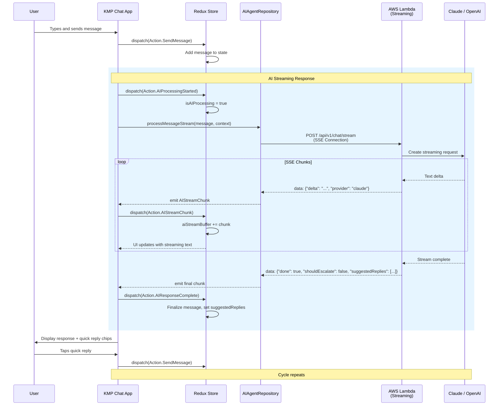
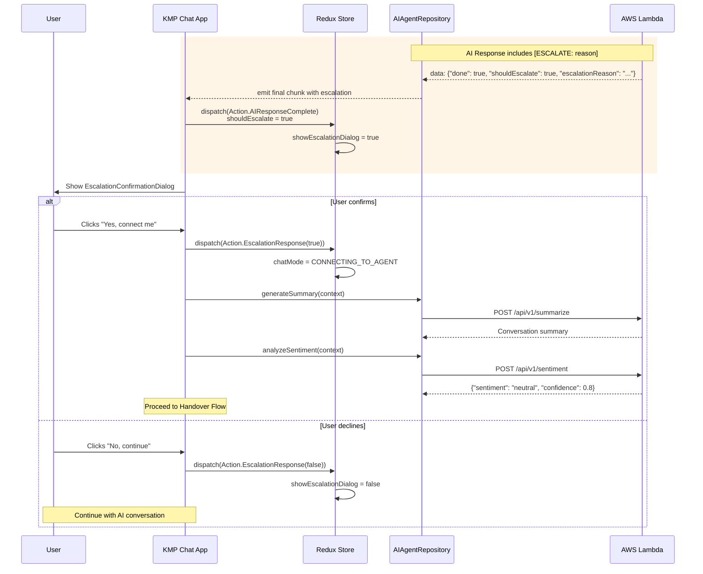
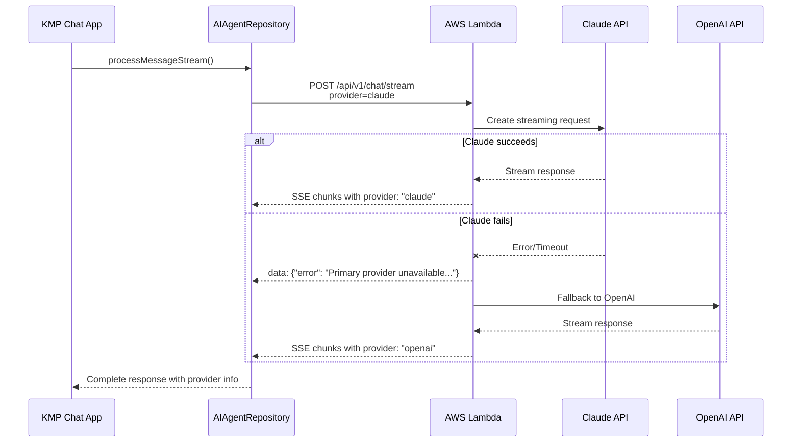

# Sequence Diagrams

This document contains sequence diagrams for the key flows in the Vanta Unified AI Chat application.

## AI Virtual Agent Flow

## AI Escalation Flow

## Handover to Human Agent Flow

```mermaid
sequenceDiagram
participant User
participant App as KMP Chat App
participant Store as Redux Store
participant Repo as ConnectChatRepository
participant AuthAPI as Backend Auth API
participant Connect as AWS Connect<br/>StartChatContact
participant PService as Participant Service<br/>(HTTPS)
participant WS as Participant Service<br/>(WebSocket)
participant Agent

      %% Phase 1: User initiates handover from Virtual Agent                                                                                                                  
      User->>App: Clicks "Talk to Agent"                                                                                                                                      
      App->>Store: dispatch(Action.InitiateHandover)                                                                                                                          
      Store->>Store: chatMode = CONNECTING_TO_AGENT                                                                                                                           
                                                                                                                                                                              
      %% Phase 2: Start Chat Contact                                                                                                                                          
      rect rgb(230, 245, 255)                                                                                                                                                 
      Note over App,Connect: StartChatContact API Flow                                                                                                                        
      App->>Repo: startHandover(authApiUrl, HandoverContext)                                                                                                                  
      Repo->>AuthAPI: POST /startChat<br/>{ParticipantDetails, Attributes}                                                                                                    
      AuthAPI->>Connect: startChatContact()                                                                                                                                   
      Connect-->>AuthAPI: ContactId, ParticipantId, ParticipantToken                                                                                                          
      AuthAPI-->>Repo: StartChatResponse                                                                                                                                      
      end                                                                                                                                                                     
                                                                                                                                                                              
      %% Phase 3: Create Participant Connection                                                                                                                               
      rect rgb(255, 245, 230)                                                                                                                                                 
      Note over Repo,PService: CreateParticipantConnection Flow                                                                                                               
      Repo->>PService: POST /participant/connection<br/>X-Amz-Bearer: {ParticipantToken}<br/>{Type: ["WEBSOCKET", "CONNECTION_CREDENTIALS"]}                                  
      PService-->>Repo: ConnectionToken, WebSocket URL, Expiry                                                                                                                
      Repo->>Repo: Store ChatSession                                                                                                                                          
      Repo-->>App: emit ConnectEvent.Connected                                                                                                                                
      end                                                                                                                                                                     
                                                                                                                                                                              
      %% Phase 4: WebSocket Connection                                                                                                                                        
      rect rgb(245, 255, 230)                                                                                                                                                 
      Note over Repo,WS: WebSocket Connection Flow                                                                                                                            
      Repo->>WS: Connect to wss://participant.connect.{region}...                                                                                                             
      WS-->>Repo: WebSocket Connected                                                                                                                                         
      Repo->>WS: {"topic": "aws/subscribe",<br/>"content": {"topics": ["aws/chat"]}}                                                                                          
      WS-->>Repo: Subscription Confirmed                                                                                                                                      
      Repo->>Repo: Start Heartbeat (every 30s)                                                                                                                                
      Repo->>Repo: connectionState = WAITING_FOR_AGENT                                                                                                                        
      end                                                                                                                                                                     
                                                                                                                                                                              
      %% Phase 5: Inject Transcript                                                                                                                                           
      rect rgb(255, 230, 245)                                                                                                                                                 
      Note over Repo,Agent: Transcript Injection                                                                                                                              
      Repo->>PService: POST /participant/message<br/>X-Amz-Bearer: {ConnectionToken}<br/>{Content: "--- Prior conversation ---<br/>[CUSTOMER]: ...<br/>[VIRTUAL AGENT]: ..."} 
      PService-->>Repo: MessageId, AbsoluteTime                                                                                                                               
      end                                                                                                                                                                     
                                                                                                                                                                              
      %% Phase 6: Agent Joins                                                                                                                                                 
      Agent->>WS: Agent accepts chat                                                                                                                                          
      WS->>Repo: {"topic": "aws/chat",<br/>"content": {Type: "EVENT",<br/>ContentType: "participant.joined",<br/>ParticipantRole: "AGENT"}}                                   
      Repo-->>App: emit ConnectEvent.ParticipantJoined                                                                                                                        
      App->>Store: dispatch(Action.ParticipantJoined)                                                                                                                         
      Store->>Store: chatMode = HUMAN_AGENT<br/>connectionState = AGENT_CONNECTED                                                                                             
      App->>User: "Agent joined the chat"                                                                                                                                     
                                                                                                                                                                              
      %% Phase 7: Live Chat                                                                                                                                                   
      rect rgb(230, 255, 245)                                                                                                                                                 
      Note over User,Agent: Bidirectional Messaging                                                                                                                           
                                                                                                                                                                              
      User->>App: Types message                                                                                                                                               
      App->>Repo: sendMessage(content)                                                                                                                                        
      Repo->>PService: POST /participant/message<br/>X-Amz-Bearer: {ConnectionToken}                                                                                          
      PService-->>Repo: MessageId                                                                                                                                             
      PService->>WS: Route to Agent                                                                                                                                           
      WS->>Agent: Message delivered                                                                                                                                           
                                                                                                                                                                              
      Agent->>WS: Agent sends reply                                                                                                                                           
      WS->>Repo: {"topic": "aws/chat",<br/>"content": {Type: "MESSAGE",<br/>Content: "...",<br/>ParticipantRole: "AGENT"}}                                                    
      Repo-->>App: emit ConnectEvent.MessageReceived
      App->>Store: dispatch(Action.ReceiveMessage)
      App->>User: Display agent message
      end
```

## Provider Fallback Flow

